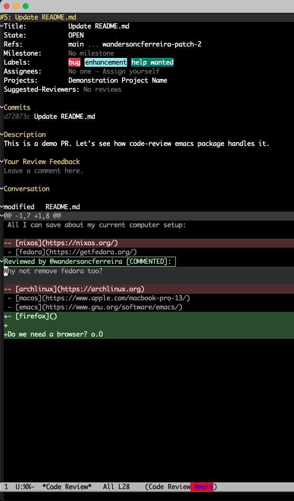
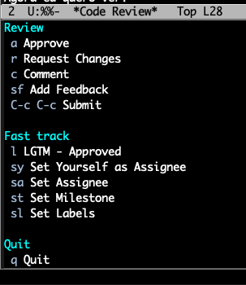

[](http://www.gnu.org/licenses/gpl-3.0.txt)
[](https://melpa.org/#/code-review)

[](https://patreon.com/bartuka)


# Code Review

Package to help you perform code reviews from your VC provider. Currently
supports Github and basic Gitlab and Bitbucket workflows.



Link to same PR on Github: https://github.com/wandersoncferreira/dotfiles/pull/5

# Overview

The Emacs everywhere goal continues. These are the main features of
`code-review` to help you never leave Emacs to do Pull Request reviews.

- Start review from URL via `code-review-start`
- Modern UI using [magit-section](https://emacsair.me/2020/01/23/magit-section/) and [transient](https://github.com/magit/transient)
- Read Pull Request comments
- Reply to comments
- Include code suggestions
- View `outdated` comments with the right diff hunk context
- Approve, Reject or Request Changes for your PRs
- Integrated with `forge-topic-view` via `code-review-forge-pr-at-point`
- Fast track commands like "LGTM! Approved"
- Review using single commits to focus on diff
- Set labels on RET. See details [Multi value selection](./docs/multi-value-selection.md)
- Set assignee. Use transient `sy` option to `assign yourself` to the PR.
- Set milestone. See details [push access required](./docs/milestone.md)
- Edit PR title
- Edit PR description body
- Merge your PR. _(beta feature) See details [merge](./docs/merge.md)_
- Reactions. See details [react to comments](./docs/reactions.md)
- Promote comments to new issues.
- Save/Resume in-progress Reviews
- Visit binary files in Dired or Remote. Example [here](https://github.com/wandersoncferreira/code-review/pull/90)
- Mention user with `C-c @` in `*code-review-comment*` buffer.

Highly recommend using the transient menu in the `*Code Review*` buffer by pressing `r`.

The basic workflow:

- `RET` on a hunk diff line to add a comment
- `RET` on a local comment to edit
- `RET` on a previous sent comment to include a reply
- `C-c C-k` on a local comment to remove it
- `r s f` to enable transient and Set a feedback
- `r a` to approve the PR | `r r` to reject the PR | `r c` to add comments in the PR

You can include your own bindings to functions like
`code-review-set-feedback`, `code-review-submit-approve`,
`code-review-submit-request-changes`, and `code-review-submit-comments` to not rely on the
transient panel. But I think you should see it :]

Take a look at which features are available to each integrated forge [here](./docs/forge_support.md).

Missing something? Please, [let us know](https://github.com/wandersoncferreira/code-review/issues/new).

# Installation

I highly recommend installing `code-review` through `package.el`.

It's available on `MELPA`.

`M-x package-install code-review`

Then you can either `M-x code-review-start` and provide a PR URL or `M-x
code-review-forge-pr-at-point` if you are in a forge buffer over a PR.

# Configuration

### Code Review

Define line wrap in comment sections.

``` emacs-lisp
(setq code-review-fill-column 80)
```

Change how `code-review` splits the buffer when opening a new PR. Defaults to
`#'switch-to-buffer-other-window`.

``` emacs-lisp
(setq code-review-new-buffer-window-strategy #'switch-to-buffer)
```

Change the destination where binary files is downloaded.

``` emacs-lisp
(setq code-review-download-dir "/tmp/code-review/")
```


#### Experimental

Use passwords configured for forge. The default is `'code-review`.

``` emacs-lisp
(setq code-review-auth-login-marker 'forge)
```


### Forge specific

Follow the documentation to your version control provider to see more details
for the setup and configuration.

- [Github](./docs/github.md)
- [Gitlab](./docs/gitlab.md)
- [Bitbucket](./docs/bitbucket.md)

# Keybindings

You can access the transient panel by hitting `r` from any place of the `Code
Review` buffer.



| Binding | Object                                | Action                      |
|:-------:|:-------------------------------------:|:---------------------------:|
| RET     | hunk                                  | Add Comment                 |
| RET     | comment                               | Add Reply                   |
| RET     | local comment (not sent to forge yet) | Edit local comment          |
| C-c C-k | local comment                         | Delete local comment        |
| C-c C-c | Comment Buffer                        | Register your local comment |
| C-c C-k | Comment Buffer                        | Cancel your local comment   |
| C-c C-r | comment                               | Add Reaction                |
| C-c C-n | comment                               | Promote to new issue        |
| C-c C-r | pr description                        | Add Reaction                |
| RET     | reaction (on emoji symbol)            | Endorse or Remove Reaction  |
| RET     | Request Reviewer                      | Request reviewer at point   |


## Binding suggestions

You can place `code-review-forge-pr-at-point` to a key binding for your convenience:

``` emacs-lisp
(define-key forge-topic-mode-map (kbd "C-c r") 'code-review-forge-pr-at-point)
```

If you are not an Evil user you can set the letter `k`, for example, to delete a
local comment or feedback at point.

``` emacs-lisp
(define-key code-review-feedback-section-map (kbd "k") 'code-review-section-delete-comment)
(define-key code-review-local-comment-section-map (kbd "k") 'code-review-section-delete-comment)
(define-key code-review-reply-comment-section-map (kbd "k") 'code-review-section-delete-comment)
```

Move between comments using `C-c C-n` and `C-c C-p`

``` emacs-lisp
(define-key code-review-mode-map (kbd "C-c C-n") 'code-review-comment-jump-next)
(define-key code-review-mode-map (kbd "C-c C-p") 'code-review-comment-jump-previous)
```

# Extension to other forges

The package allows you to write integration with other forges to leverage these
functionalities. Take a look at `code-review-interfaces.el` to see which functions
need to be implemented.


# Thanks

Thanks [Laurent Charignon](https://github.com/charignon) for the awesome
[github-review](https://github.com/charignon/github-review) package and
stewardship. Github Review made me more familiar with the problem domain and
`code-review` is an attempt to build on top of it.

Thanks [Ag Ibragimov](https://github.com/agzam) for the amazing idea to use
`magit-section` to build a more suitable interface to this problem.
