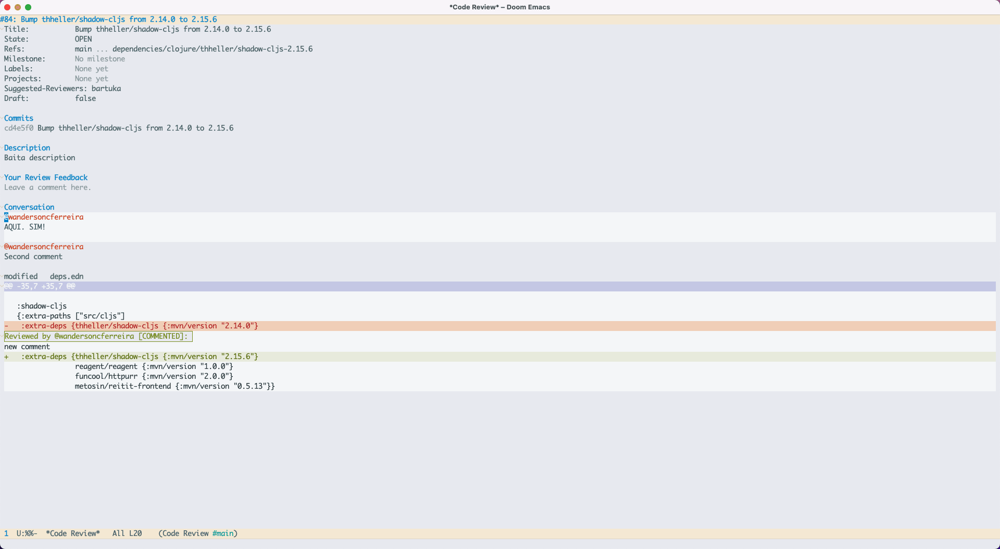

# Reactions

You can react with Emojis to any comment.




### Keybindings

Press `RET` on emoji symbol to endorse or remove it.

Press `C-c C-r` to a comment to add a new reaction.


### Customization

If you want to change the keybindings to how reactions are added in the buffer
use the keymaps below.

```elisp
(define-key code-review-description-section-map (kbd "C-c C-r") 'code-review-description-reaction-at-point)
(define-key code-review-code-comment-section-map (kbd "C-c C-r") 'code-review-code-comment-reaction-at-point)
(define-key code-review-comment-section-map (kbd "C-c C-r") 'code-review-conversation-reaction-at-point)
```

We have three functions because each comment section is slightly different
objects and allow slightly different behaviors across the app.
